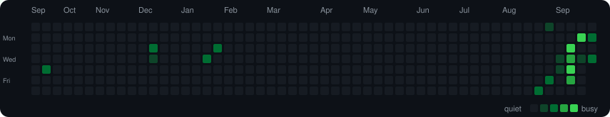
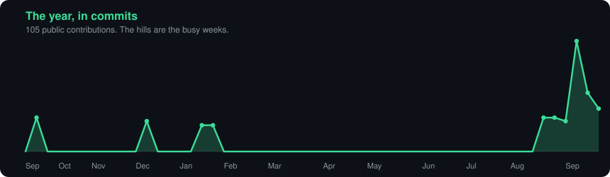

<h1 align="center">Hey, I'm Mitchelle 👋</h1>

  

  I build AI agents and the apps around them. 
  A speaker of the language. A person asking for credit. A business still doing it by hand.

  <a href="https://mitchelles-devportforlio.lovable.app/"><strong>Portfolio</strong></a>
  &nbsp;·&nbsp;
  <a href="https://www.linkedin.com/in/mitchelle-ashimosi"><strong>LinkedIn</strong></a>
  &nbsp;·&nbsp;
  <a href="https://github.com/rxymitchy?tab=repositories"><strong>Repos</strong></a>

### Currently poking at

- [Taska](https://github.com/rxymitchy/taska) hands an AI answer to someone who actually speaks the language, then writes down that they got paid.
- [Kredoof](https://github.com/rxymitchy/Kredoof) lets a wallet's history sit down with a credit model and explain itself.
- [Northline](https://github.com/rxymitchy/northline) reads how a business works and points at the jobs that still need a human. [It's live](https://northline-8j55.onrender.com). Click around.

Notebook mode is loans, land, and game-theory agents who are bad at being rational on purpose.

### Languages and tools

  <strong>Languages</strong> 
  

  <strong>Building the product</strong> 
  

  <strong>Where the data lives</strong> 
  

Bitcoin Lightning payouts on Taska. Wallet-connected scoring on Kredoof. Auth.js and Zod when a form needs to behave.

### The scoreboard

  

  
  

  

### The snake has a job

  

It crosses the year one square at a time. Quiet weeks stay dim. September did not.

  

### Projects with the lights on

  
  

  
  

Also in the mix: [loan eligibility](https://github.com/rxymitchy/Loan-Approval-Prediction) and [whether a site can take another building](https://github.com/rxymitchy/LandResourceUtilizationFlask).

### Come build in public

Made something useful? Don't leave it in a drawer. Put it on GitHub this week.

Say what it does in the first five lines. Add the commands to run it. Pick a license. Leave one issue a new person can finish after dinner.

If you'd rather practice on code that already has a pulse, pull up a chair:

- [Northline](https://github.com/rxymitchy/northline) is the friendly door. MIT license, a [contributing guide](https://github.com/rxymitchy/northline/blob/master/CONTRIBUTING.md), and it likes pull requests that fit in one sitting.
- [Taska](https://github.com/rxymitchy/taska) and [Kredoof](https://github.com/rxymitchy/Kredoof) will take a careful change too. Read the README, fix one thing, tell me what you tried.

Shipping is the fun part. Showing up afterward is how it stays fun for the next person.
